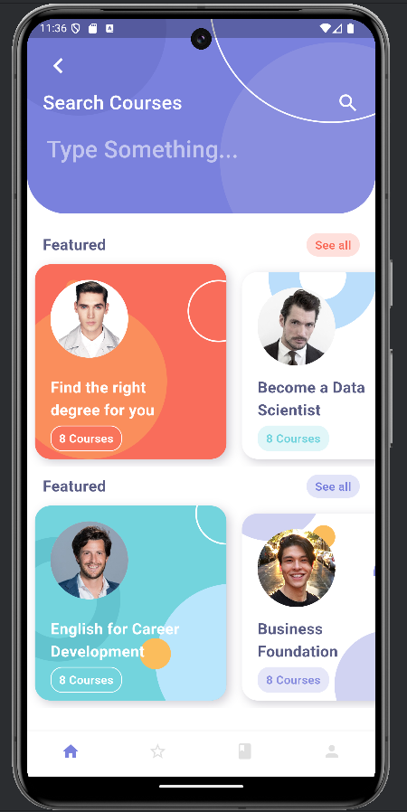
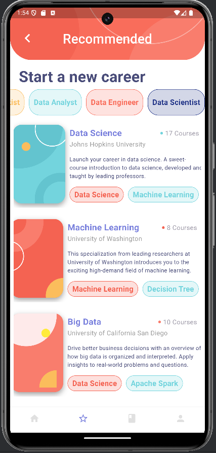

# Education Application Two UI

A new Flutter project.

## Getting Started

This project is a starting point for a Flutter application.

A few resources to get you started if this is your first Flutter project:

- [Lab: Write your first Flutter app](https://docs.flutter.dev/get-started/codelab)
- [Cookbook: Useful Flutter samples](https://docs.flutter.dev/cookbook)

For help getting started with Flutter development, view the
[online documentation](https://docs.flutter.dev/), which offers tutorials,
samples, guidance on mobile development, and a full API reference.

## Credits

Smart course app is built in flutter. App design is based on [Smart Course](https://dribbble.com/shots/10090738-SmartCourse) designed by [Nugraha Jati Utama](https://dribbble.com/nugrahajatiutama)

 

## Screenshots

| Android HomePage | Android Recommended Page |
|------------------|---------------------------|
|  |  |
